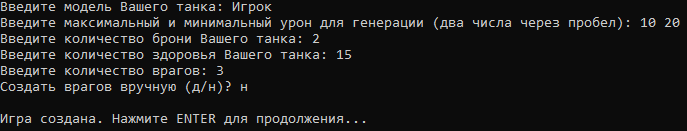
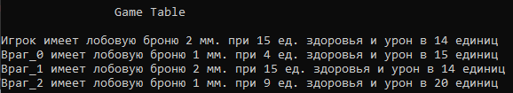
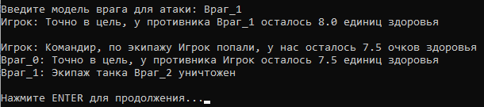

# Текстовая консольная игра "Танки"

## Содержание

- [Текстовая консольная игра "Танки"](#текстовая-консольная-игра-танки)
  - [Содержание](#содержание)
  - [Об игре / About](#об-игре--about)
  - [Правила / Rules](#правила--rules)
    - [RU](#ru)
    - [ENG](#eng)
  - [Требования / Requirements](#требования--requirements)
  - [Автор / Author](#автор--author)

## Об игре / About

Это небольшая консольная игра под названием "**Танки**". В игре создается танк игрока и любое количество противников. Каждый ход Вы выбираете по кому выстрелить. Задача игры - победить всех противников.
This is a small console game called "**Tanks**". The game creates a player's tank and any number of opponents. Each turn you choose who to shoot. The objective of the game is to defeat all opponents.

<!--  -->

## Правила / Rules

### RU

1. У каждого танка существует определенный набор параметров: модель (имя), здоровье, урон и броня.
2. Игра начинается с создания собственного танка. Игрок задает все параметры для собственного танка вручную, исключая параметр урона. Для урона задается диапазон, в рамках которого выбирается значение.
3. Далее предлагается выбрать количество врагов и способ генерации. Возможно создать врагов вручную, повторяя действия при создании танка игрока или выбрать автоматическую генерацию
    

    >*Автоматический генератор создает противников с характеристиками превышающими характеристики игрока не более чем на 25%. Значение урона остается в диапазоне, заданном игроком.*

4. После генерации начинается процесс игры. Выводится таблица активных танков на момент начала данного хода.
    

5. Каждый ход игроку предлагается выбрать, какой вражеский танк атаковать. После выбора проходит фаза атак врагов. В консоль выводятся логи атак и смертей.
    

    > *Урон в игре расчитывается по формуле: **урон = сила_атаки / показатель_брони***
6. Игра завершается в случае победы или поражения игрока. Победой считается уничтожение всех врагов, поражением - смерть игрока.

### ENG

1. Each tank has a certain set of parameters: model (name), health, damage and armor.
2. The game starts with creating your own tank. The player sets all the parameters for his own tank manually, excluding the damage parameter. For damage, a range is set within which a value is selected.
3. Next, it is proposed to choose the number of enemies and the method of generation. It is possible to create enemies manually, repeating the steps when creating a player's tank, or choose automatic generation
    >*Auto generator creates opponents with stats that exceed the player's stats by no more than 25%. The damage value stays within the range set by the player.*
4. After generation, the game process begins. A table of active tanks at the start of a given turn is displayed.
5. Each turn the player is asked to choose which enemy tank to attack. After the choice, the attack phase of the enemies passes. Logs of attacks and deaths are displayed in the console.
   > *Damage in the game is calculated according to the formula: **damage = attack_power / armor_rate***
6. The game ends if the player wins or loses. Victory is the destruction of all enemies, defeat - the death of the player.

## Требования / Requirements

> *`conda` требуется только для работы функции `cls`. Возможно использовать любой другой интерпретатор, но для этого необходимо заменить `'cls'` в [исполняемом файле игры](game.py) на строчках `68` и `92` на соответствующую функцию для вашего терминала.*

| package | version |
|---------|---------|
| python  | 3.6++   |
| conda   | 21.3++  |

## Автор / Author

2022,
Grandilevskii Aleksei, software engineer,
github: [@zer0deck](https://github.com/zer0deck),
email: zer0deck.work@icloud.com,
website: zer0deck.com
